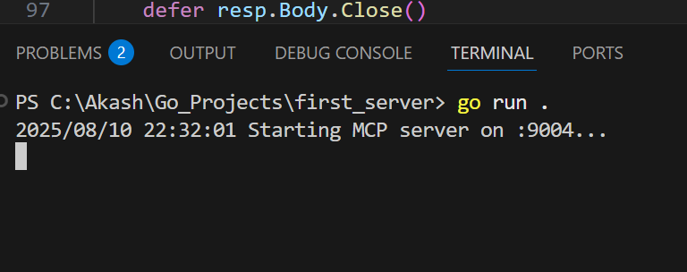
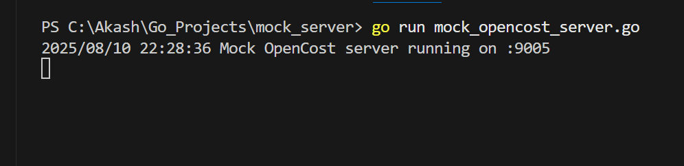
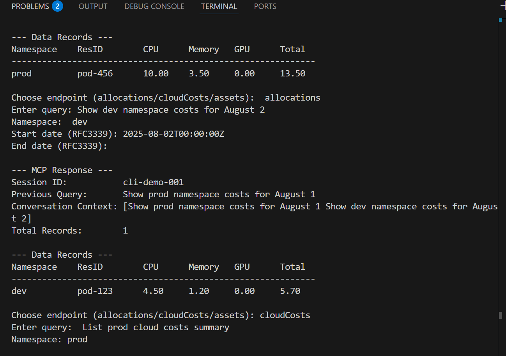
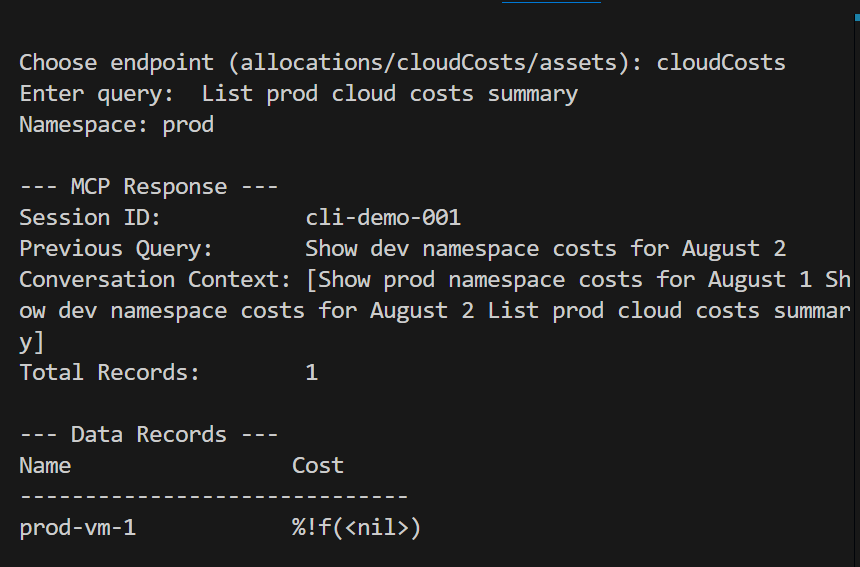
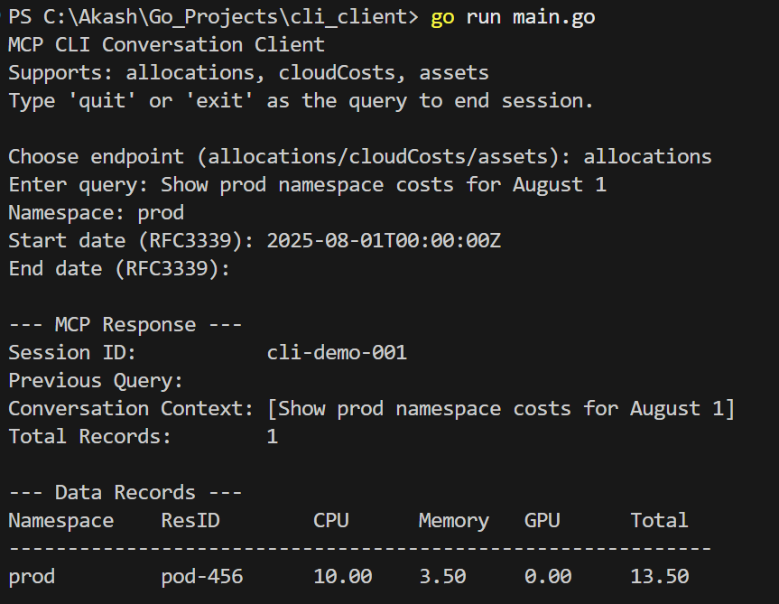

```markdown
# 🚀 MCP Server Project 

*A context-aware MCP server for cloud costs, allocations, and assets*

---

## 📑 Table of Contents
1. [Overview](#-overview)
2. [Features](#-features)
3. [Tech Stack](#-tech-stack)
4. [Project Structure](#-project-structure)
5. [Installation & Setup](#️-installation--setup)
6. [Usage](#-usage)
7. [Architecture Diagram](#-architecture-diagram)
8. [Screenshots ](#-screenshots)
9. [Contributing](#-contributing)
10. [Contact](#-contact)

---

## 📖 Overview
The **MCP Server** in this project acts as a smart, multi-endpoint backend that can communicate with an OpenCost-style mock data provider.  
It is designed to **maintain conversation context** between queries so that an AI agent or CLI client can have stateful, multi-turn interactions across multiple endpoints.

This project demonstrates how to design an AI-friendly API layer with session memory, enabling more natural, context-aware experiences for:
- Cost analysis
- Resource allocation insights
- Asset discovery

---

## 🌟 Features
- **Multi-Endpoint API** — `/allocations`, `/cloudCosts`, `/assets` with consistent patterns.  
- **GET and POST Support** — Quick lookups or full *AgenticQuery* JSON with `filters` + `context`.  
- **Multi-Turn Conversation Tracking** — Keeps `previous_query` and a running `conversation_context` for each `session_id`.  
- **Interactive CLI Client** — Human-friendly interface with pretty-printed tables and graceful exits.  
- **Mock Backend** — Fully simulated OpenCost API so the entire project runs locally without real billing data.  
- **Cross-Endpoint Context** — Same `session_id` can remember context when switching between endpoints.  

---

## 🛠 Tech Stack
- **Language:** Go (Golang)  
- **Server:** `net/http`, `encoding/json`  
- **CLI:** Go `bufio`, `fmt`, `os`, `strings`  
- **Mock Backend:** Custom HTTP mock server returning JSON  
- **Docs & Tools:**  
  - Markdown for documentation  
  - (Optional) `curl` / Postman for API testing  

---

## 📂 Project Structure
```

open-cost-challenge/
│── mock\_server/         # Mock OpenCost backend service
│   └── mock\_opencost\_server.go
│── mcp\_server/          # MCP (Multi-Context Processor) server
│   ├── main.go
│   └── opencost\_client.go
│── cli\_client/          # Go CLI client for interactive queries
│   └── main.go
│── docs/                # Documentation and screenshots
│   ├── mcp\_server\_running.png
│   ├── mock\_server\_running.png
│   ├── cli\_alloc1.png
│   ├── cli\_alloc2.png
│   ├── cli\_cloudcost.png
│   └── cli\_quit.png
│── go.mod               # Go module dependencies
│── .gitignore
│── README.md

````

---

## ⚙️ Installation & Setup
1. **Clone the repository**
   ```bash
   git clone https://github.com/ak4shravikumar/open-cost-challenge.git
   cd open-cost-challenge
````

2. **Run the Mock Backend**

   ```bash
   cd mock_server
   go run mock_opencost_server.go
   ```

3. **Run the MCP Server**

   ```bash
   cd ../mcp_server
   go run main.go opencost_client.go
   ```

4. **Run the CLI Client**

   ```bash
   cd ../cli_client
   go run main.go
   ```

---

## 🚦 Usage

Example CLI session:

```
Choose endpoint (allocations/cloudCosts/assets): allocations
Enter query: Show prod namespace costs for August 1
Namespace: prod
Start date (RFC3339): 2025-08-01T00:00:00Z
End date (RFC3339):

--- MCP Response ---
Session ID:           cli-demo-001
Previous Query:
Conversation Context: [Show prod namespace costs for August 1]
Total Records:        1

--- Data Records ---
Namespace    ResID        CPU      Memory   GPU      Total
------------------------------------------------------------
prod         pod-456      10.00    3.50     0.00     13.50
```

---

## 🏗 Architecture Diagram

```
MCP CLI Client
 ├─> User Query → Select Endpoint
 │    └─> AgenticQuery JSON
 ├─> Send → MCP Server
 │     ├─> Manage Session Context
 │     ├─> NLP → Backend Request
 │     ├─> Route to Backend:
 │     │     ├─ OpenCost API
 │     │     └─ Mock Backend
 │     └─> Format Response
 └─> CLI Output
       └─> Session Logs
```

---

## 📸 Screenshots 


### 1. First Server Setup


### 2. Mock Server


### 3. Allocation Query – Example 1


### 4. Allocation Query – Example 2


### 5. Cloud Cost Query


### 6. CLI Conversation


### 7. Session End


## 🤝 Contributing

We welcome contributions!

1. Fork this repository
2. Create your feature branch (`git checkout -b feature/amazing-feature`)
3. Commit your changes (`git commit -m 'Add amazing feature'`)
4. Push to the branch (`git push origin feature/amazing-feature`)
5. Open a Pull Request

---

## 📬 Contact

* **Author:** Akash Ravikumar
* **Email:** [ak4shravikumar@gmail.com](mailto:ak4shravikumar@gmail.com)
* **GitHub:** [ak4shravikumar](https://github.com/ak4shravikumar)
* **Project URL:** [https://github.com/ak4shravikumar/open-cost-challenge](https://github.com/ak4shravikumar/open-cost-challenge)

```

